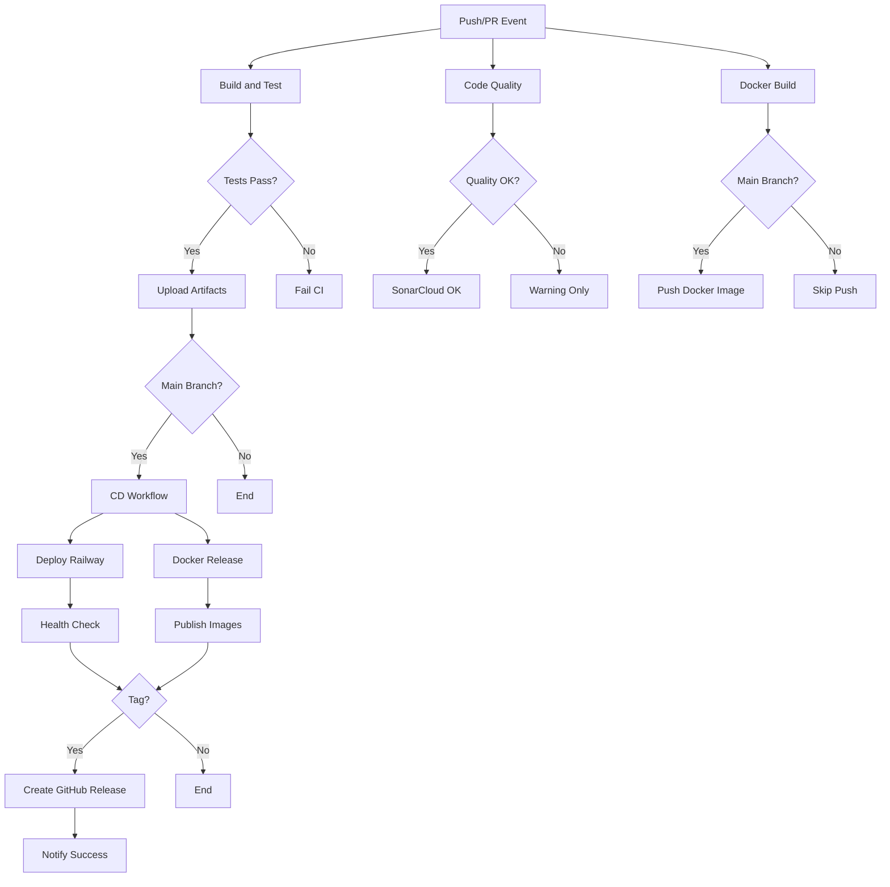

# Diagrama de Workflows CI/CD

## Visão Geral da Arquitetura

```
┌─────────────────────────────────────────────────────────────────┐
│                        GITHUB REPOSITORY                         │
│                   api-crud-contrucao (main/develop)              │
└────────────────────┬───────────────────────────────────┬─────────┘
                     │                                   │
         ┌───────────▼──────────┐            ┌──────────▼──────────┐
         │   Push / Pull Request │            │   Weekly Schedule    │
         │   (main, develop)     │            │   (Monday 00:00)     │
         └───────────┬──────────┘            └──────────┬──────────┘
                     │                                   │
                     ▼                                   ▼
    ┌────────────────────────────────┐    ┌────────────────────────┐
    │    CI WORKFLOW (ci.yml)        │    │ SECURITY (security.yml)│
    ├────────────────────────────────┤    ├────────────────────────┤
    │                                │    │                        │
    │  1. Build & Test               │    │  1. OWASP Dependency   │
    │     ├─ Setup JDK 17            │    │     Check              │
    │     ├─ Maven Cache             │    │  2. Trivy Container    │
    │     ├─ Compile                 │    │     Scan               │
    │     ├─ Unit Tests              │    │  3. CodeQL Analysis    │
    │     ├─ Integration Tests       │    │                        │
    │     └─ JaCoCo Coverage         │    │  → Security Reports    │
    │                                │    │  → SARIF Upload        │
    │  2. Code Quality               │    └────────────────────────┘
    │     ├─ Checkstyle              │
    │     ├─ PMD                     │
    │     ├─ SpotBugs                │
    │     └─ SonarCloud              │
    │                                │
    │  3. Docker Build               │
    │     ├─ Build Image             │
    │     └─ Push to Docker Hub      │
    │                                │
    │  Artifacts:                    │
    │    └─ api-crud-jar (7 days)    │
    └────────────┬───────────────────┘
                 │
                 │ (if main branch or tag)
                 │
                 ▼
    ┌────────────────────────────────┐
    │   CD WORKFLOW (cd.yml)         │
    ├────────────────────────────────┤
    │                                │
    │  1. Deploy Production          │
    │     ├─ Railway Deploy          │
    │     ├─ Wait 30s                │
    │     └─ Health Check            │
    │                                │
    │  2. Docker Release             │
    │     ├─ Tag: latest             │
    │     ├─ Tag: v1.0.0 (if tag)    │
    │     └─ Push to Docker Hub      │
    │                                │
    │  3. GitHub Release (tags only) │
    │     ├─ Generate Changelog      │
    │     ├─ Attach JAR              │
    │     └─ Publish Release         │
    │                                │
    │  4. Notifications              │
    │     └─ Deploy Status           │
    └────────────┬───────────────────┘
                 │
                 ├───────────────┬───────────────┬──────────────┐
                 ▼               ▼               ▼              ▼
         ┌──────────────┐ ┌────────────┐ ┌───────────┐ ┌─────────────┐
         │   RAILWAY    │ │ DOCKER HUB │ │  CODECOV  │ │ SONARCLOUD  │
         │              │ │            │ │           │ │             │
         │ Production   │ │ Images:    │ │ Coverage  │ │ Quality     │
         │ Environment  │ │  - latest  │ │ Reports   │ │ Metrics     │
         │              │ │  - v1.0.0  │ │           │ │             │
         │ Health: ✅   │ │            │ │ 85% ✅    │ │ A Grade ✅  │
         └──────────────┘ └────────────┘ └───────────┘ └─────────────┘
```

## Fluxo Detalhado por Evento

### 1. Developer Push/PR para `develop`

```
Developer
    │
    ├─> git push origin develop
    │
    ▼
GitHub Actions
    │
    ├─> CI Workflow Triggered
    │   ├─> Build & Test
    │   │   ├─> Compile ✅
    │   │   ├─> Unit Tests ✅
    │   │   └─> Integration Tests ✅
    │   │
    │   ├─> Code Quality
    │   │   ├─> Checkstyle ✅
    │   │   ├─> PMD ✅
    │   │   ├─> SpotBugs ✅
    │   │   └─> SonarCloud ✅
    │   │
    │   └─> Docker Build ✅
    │
    ▼
PR Status Check
    │
    └─> ✅ Ready for Review
```

### 2. Merge to `main`

```
Merge to main
    │
    ├─> CI Workflow ✅
    │
    ├─> CD Workflow Triggered
    │   │
    │   ├─> Deploy to Railway
    │   │   ├─> Build on Railway
    │   │   ├─> Start Service
    │   │   └─> Health Check ✅
    │   │
    │   ├─> Publish Docker
    │   │   ├─> Tag: latest
    │   │   └─> Push to Hub ✅
    │   │
    │   └─> Notifications
    │       └─> Slack/Email ✅
    │
    ▼
Production Live! 🚀
```

### 3. Release Tag `v1.0.0`

```
git tag v1.0.0
    │
    ├─> CI Workflow ✅
    │
    ├─> CD Workflow (Extended)
    │   │
    │   ├─> Deploy to Railway ✅
    │   │
    │   ├─> Docker Multi-Tag
    │   │   ├─> Tag: v1.0.0
    │   │   ├─> Tag: latest
    │   │   └─> Push Both ✅
    │   │
    │   ├─> GitHub Release
    │   │   ├─> Generate Changelog
    │   │   ├─> Attach demo.jar
    │   │   ├─> Release Notes
    │   │   └─> Publish ✅
    │   │
    │   └─> Notifications
    │       └─> Release v1.0.0 Published! ✅
    │
    ▼
Release Complete! 🎉
```

### 4. Weekly Security Scan

```
Monday 00:00 UTC
    │
    ├─> Security Workflow
    │   │
    │   ├─> OWASP Dependency Check
    │   │   ├─> Scan Dependencies
    │   │   ├─> Check CVEs
    │   │   └─> Report (Fail on CVSS ≥ 8)
    │   │
    │   ├─> Trivy Container Scan
    │   │   ├─> Build Image
    │   │   ├─> Scan Layers
    │   │   └─> SARIF Report
    │   │
    │   └─> CodeQL Analysis
    │       ├─> Build Code
    │       ├─> Analyze Patterns
    │       └─> Security Report
    │
    ▼
Security Dashboard Updated
    │
    └─> Email if Issues Found 📧
```

## Jobs e Dependências



## Matriz de Execução

| Evento | CI | CD | Security |
|--------|----|----|----------|
| Push to `develop` | ✅ | ❌ | ❌ |
| PR to `develop` | ✅ | ❌ | ❌ |
| Push to `main` | ✅ | ✅ | ❌ |
| PR to `main` | ✅ | ❌ | ✅ |
| Tag `v*` | ✅ | ✅ (+ Release) | ❌ |
| Schedule (Weekly) | ❌ | ❌ | ✅ |
| Manual Trigger | ✅ | ✅ | ✅ |

## Tempo Estimado de Execução

| Workflow | Job | Tempo Médio |
|----------|-----|-------------|
| CI | Build & Test | ~3 min |
| CI | Code Quality | ~2 min |
| CI | Docker Build | ~4 min |
| **CI Total** | | **~9 min** |
| CD | Deploy Railway | ~2 min |
| CD | Docker Release | ~3 min |
| CD | GitHub Release | ~1 min |
| **CD Total** | | **~6 min** |
| Security | Dependency Check | ~4 min |
| Security | Trivy Scan | ~3 min |
| Security | CodeQL | ~5 min |
| **Security Total** | | **~12 min** |

## Recursos Consumidos

### GitHub Actions Minutes
- **CI Workflow:** ~9 min por execução
- **CD Workflow:** ~6 min por execução
- **Security Workflow:** ~12 min por execução

**Estimativa mensal (projeto ativo):**
- Pushes: 40/mês × 9 min = 360 min
- Deploys: 20/mês × 6 min = 120 min
- Security: 4/mês × 12 min = 48 min
- **Total:** ~528 min/mês (dentro do limite free: 2000 min/mês)

### Artefatos
- JAR files: ~50 MB por build (retidos por 7 dias)
- Reports: ~10 MB por build (retidos por 7 dias)
- Docker layers: Cache otimizado (reuso de layers)

## Integrações Externas

```
┌─────────────────────────────────────────────┐
│         GITHUB ACTIONS WORKFLOWS             │
└────────┬──────────┬──────────┬──────────────┘
         │          │          │
    ┌────▼────┐ ┌──▼───┐ ┌───▼────┐
    │ Railway │ │Docker│ │ Quality│
    │  Deploy │ │  Hub │ │ Tools  │
    └─────────┘ └──────┘ └────────┘
         │          │          │
         │          │          ├──> SonarCloud
         │          │          ├──> Codecov
         │          │          └──> GitHub Security
         │          │
         │          └──> Public Registry
         │               (api-crud-contrucao:latest)
         │
         └──> Production Environment
              (https://api-crud-contrucao.up.railway.app)
```

## Estratégia de Rollback

Em caso de falha no deploy:

1. **Automático (Railway):**
   - Railway mantém última versão estável
   - Falha no health check = não roteia tráfego

2. **Manual:**
   ```bash
   # Reverter para tag anterior
   docker pull username/api-crud-contrucao:v1.0.0

   # Ou re-deploy via Railway CLI
   railway up --service api-crud-contrucao
   ```

3. **Git Revert:**
   ```bash
   git revert <commit-hash>
   git push origin main
   # CI/CD re-executa automaticamente
   ```

## Monitoramento e Alertas

### Status Checks
- ✅ GitHub Actions badge no README
- ✅ Health endpoint: `/actuator/health`
- ✅ Railway dashboard

### Logs
- **GitHub Actions:** Logs de cada job/step
- **Railway:** Application logs
- **Docker Hub:** Build history
- **SonarCloud:** Quality trends

### Notificações
- GitHub notifications (PR checks)
- Email on workflow failure
- Railway deployment status

---

**Última atualização:** 2024
**Versão:** 1.0.0
