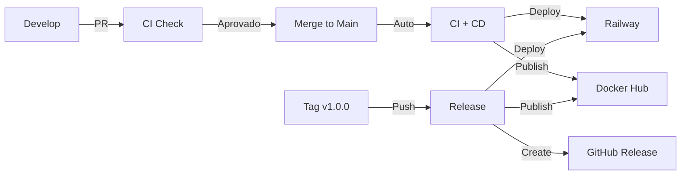

# CI/CD Quick Start Guide

## 🚀 Início Rápido

### Passo 1: Configure os Secrets

Acesse: **Settings → Secrets and variables → Actions → New repository secret**

Adicione os secrets mínimos:

```bash
DOCKER_USERNAME     # Seu usuário do Docker Hub
DOCKER_PASSWORD     # Sua senha/token do Docker Hub
RAILWAY_TOKEN       # Token do Railway (veja abaixo como obter)
```

#### Como obter o Railway Token:

```bash
npm i -g @railway/cli
railway login
railway whoami --token
```

### Passo 2: Faça um Push

```bash
git add .
git commit -m "ci: configura pipeline CI/CD"
git push origin main
```

### Passo 3: Acompanhe a Execução

Acesse: **Actions** → Veja os workflows executando

## 📋 Checklist de Configuração

- [ ] Secrets configurados no GitHub
- [ ] Railway conectado ao repositório
- [ ] Docker Hub configurado
- [ ] Branch protection ativada em `main`
- [ ] Primeiro workflow executado com sucesso

## 🔄 Workflows Criados

### 1. CI - Continuous Integration
**Quando executa:** Push/PR para `main` ou `develop`

**O que faz:**
- ✅ Compila o código
- ✅ Roda testes unitários
- ✅ Roda testes de integração
- ✅ Gera relatório de cobertura
- ✅ Análise de qualidade (Checkstyle, PMD, SpotBugs)
- ✅ Build da imagem Docker

### 2. CD - Continuous Deployment
**Quando executa:** Push para `main` ou tags `v*`

**O que faz:**
- 🚀 Deploy automático no Railway
- 🐳 Publica imagem Docker
- 📦 Cria release no GitHub (se tag)
- 🏥 Health check da aplicação

### 3. Security Scan
**Quando executa:** Toda segunda-feira + Push/PR

**O que faz:**
- 🔒 OWASP Dependency Check
- 🔒 Trivy Container Scan
- 🔒 CodeQL Analysis

## 🎯 Fluxo de Trabalho



## 📊 Monitoramento

### Badges no README

O README.md agora exibe badges de status:
- 
- 
- 

### Onde Acompanhar

- **GitHub Actions:** Todos os workflows e logs
- **Railway:** Status do deploy e logs da aplicação
- **Docker Hub:** Imagens publicadas
- **Codecov:** Cobertura de testes (se configurado)
- **SonarCloud:** Qualidade do código (se configurado)

## 🏷️ Criando uma Release

```bash
# 1. Atualize a versão (se necessário)
vim springboot/demo/pom.xml

# 2. Commit
git add .
git commit -m "chore: bump version to 1.0.0"
git push

# 3. Crie a tag
git tag -a v1.0.0 -m "Release 1.0.0 - Primeira versão estável"
git push origin v1.0.0
```

Isso vai:
- ✅ Criar release no GitHub
- ✅ Anexar o JAR
- ✅ Gerar changelog automático
- ✅ Publicar Docker com tag `v1.0.0` e `latest`

## 🛠️ Testando Localmente

Antes de fazer push, teste localmente:

```bash
# Testes
cd springboot/demo
./mvnw clean verify

# Build Docker
cd ../..
docker build -t api-crud-local .

# Executar
docker run -p 8089:8089 api-crud-local
```

## 🆘 Problemas Comuns

### CI Falha

**Testes não passam:**
```bash
./mvnw test
```

**Checkstyle/PMD erros:**
```bash
./mvnw checkstyle:check pmd:check
```

### CD Falha

**Railway não conecta:**
- Verifique se `RAILWAY_TOKEN` está correto
- Confirme que o projeto existe no Railway

**Docker push falha:**
- Verifique `DOCKER_USERNAME` e `DOCKER_PASSWORD`
- Use access token ao invés de senha

### Health Check Falha

- Verifique se a aplicação está rodando
- Confirme que `/actuator/health` está acessível
- Veja logs no Railway

## 📚 Documentação Completa

Para detalhes completos, consulte:
- [CICD_SETUP.md](.github/CICD_SETUP.md) - Guia completo de configuração
- [README.md](README.md) - Documentação da API

## 🔐 Secrets Opcionais (Recomendados)

Para recursos avançados:

```bash
SONAR_TOKEN         # Análise de qualidade no SonarCloud
CODECOV_TOKEN       # Relatórios de cobertura no Codecov
```

## ✅ Verificação Final

Confirme que tudo está funcionando:

1. [ ] CI passa no primeiro push
2. [ ] CD faz deploy no Railway
3. [ ] Docker image foi publicada
4. [ ] Health check retorna 200 OK
5. [ ] Badges aparecem no README

## 🎉 Próximos Passos

Agora que o CI/CD está configurado:

1. Configure branch protection em `main`
2. Crie uma branch `develop` para desenvolvimento
3. Use Pull Requests para mudanças
4. Monitore métricas de qualidade
5. Mantenha dependências atualizadas

---

**Dúvidas?** Consulte [.github/CICD_SETUP.md](.github/CICD_SETUP.md) ou abra uma issue!
